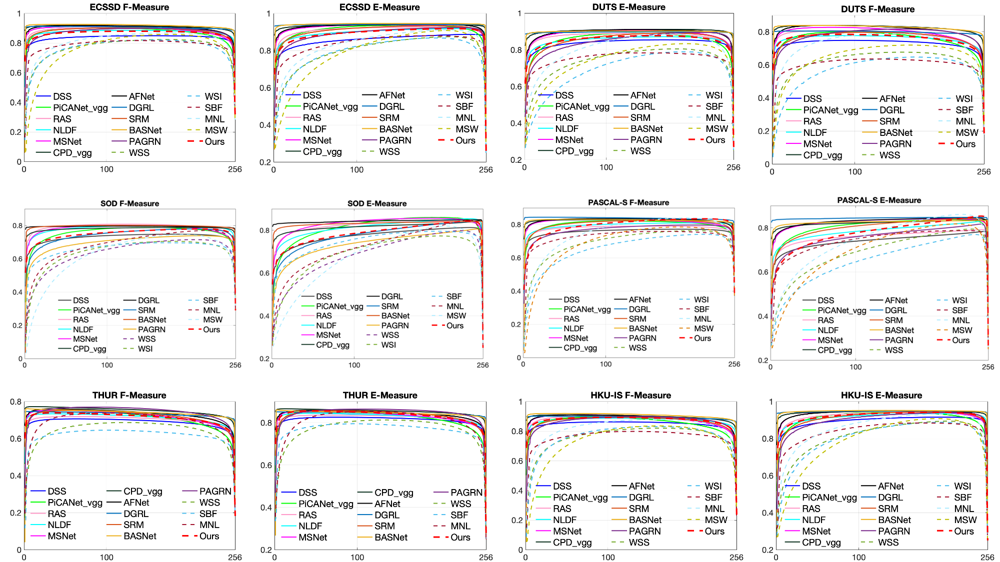

# Noise-aware-ABP-Saliency
Learning Noise-Aware Encoder-Decoder from Noisy Labels by Alternating Back-Propagation for Saliency Detection


We provide the pytorch version of our code, and the paddlepaddle version code will be release soon.

## Saliency Maps
We provide saliency map on eight saliency dataset, including DUT, DUTS, ECSSD, HKU-IS, MSRA-B, THUR, PASCAL-S and SOD.

Please download our saleincy map from:
https://drive.google.com/file/d/1uyVkJcTw-2C60nJs2Czt_QoJ-_Z20YBh/view?usp=sharing

## Training Dataset
We use DUTS (http://saliencydetection.net/duts/) as our training dataset, and compute saliency maps using three different conventional saliency detection methods: RBD (Saliency optimization from robust backgrounddetection), MR (aliency detection via graph-based  manifold  ranking) and GS (eodesic saliency using background priors), and treat them as "noisy label".

Please find the noisy saliency map from:
https://drive.google.com/file/d/1S0tAG63xMxOnnBPq5aNfE5dYXTTM6kgJ/view?usp=sharing

## Testing Dataset
Please find link below for the eight testing datsset we used, incluing both images and their corresponding ground truth saliency maps.
https://drive.google.com/drive/folders/1xak2fPZRPnZyzTyzsK2OmdoLk91O9VuQ?usp=sharing

## Performance
We show the E-measure and F-measure curves on six benchmark dataset as below:


## Trained Model
Please find our trained model from:

## Training the model

## Testing the model

## Contact
Please contact zjnwpu@gmail.com for further discussion.

## Reference
Please cite our paper if necessary.
```
@inproceedings{Zhang2020UCNet,
  title={Learning Noise-Aware Encoder-Decoder from Noisy Labels by Alternating Back-Propagation for Saliency Detection},
  author={Zhang, Jing and Xie, jianwen and Barnes, Nick},
  booktitle={European Conference on Computer Vision},
  year={2020}
}
```


