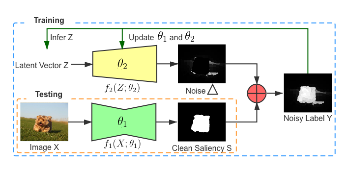

# Noise-aware-ABP-Saliency
Learning Noise-Aware Encoder-Decoder from Noisy Labels by Alternating Back-Propagation for Saliency Detection

## Saliency Maps
We provide saliency map on eight saliency dataset, including DUT, DUTS, ECSSD, HKU-IS, MSRA-B, THUR, PASCAL-S and SOD.

Please download our saleincy map from:
https://drive.google.com/file/d/1uyVkJcTw-2C60nJs2Czt_QoJ-_Z20YBh/view?usp=sharing

## Training Dataset
We use DUTS (http://saliencydetection.net/duts/) as our training dataset, and compute saliency maps using three different conventional saliency detection methods: RBD (Saliency optimization from robust backgrounddetection), MR (aliency detection via graph-based  manifold  ranking) and GS (eodesic saliency using background priors), and treat them as "noisy label".

Please find the noisy saliency map from:
https://drive.google.com/file/d/1S0tAG63xMxOnnBPq5aNfE5dYXTTM6kgJ/view?usp=sharing

